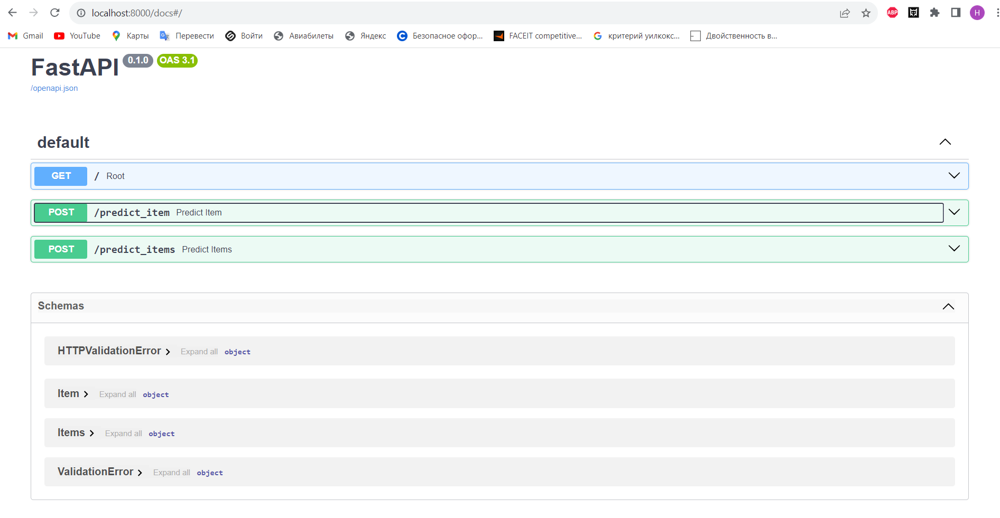

# Финальная версия модели

**Препроцессинг**:

* Для числовых фичей заполняем пропущенные значения средними, стандартизуем
* Категориальные фичи пропускаем через `OneHotEncoder` (последнюю не дропаем)
* Из обучающей выборки удаляем выбросы по таргету, а так же по фичам `km_driven` и `max_torque_rpm`

**Генерация фичей**:

Были добавлены фичи:
1. `brand` - марка машины
2. `km_year_ratio` - среднее количество километров в год
3. `torque_ratio` - отношение `torque` к объему двигателя
4. `max_torque_rpm_ratio` - отношение `max_torque_rpm` к объему двигателя
5. `good_conditions_flg` - флаг собственник + меньше 3 владельце
6. Так же были добавлены всевозможные квадраты и попарные произведения, имеющихся фичей (`PolynomialFeatures`)

**Конфигурация модели**

* Используется Ridge регрессия, с коэффициентов регуляризации `alpha` 4.95
* Таргет прологарифмирован, для приближения к нормальному распределению

# Что еще пробовалось

* Пробовалось добавлять другие трансформации фичей (логарифмирование, корень) - Были избыточными
* Пробовались другие трансформации таргета (корень) - Логарифмирование подошло лучше всего
* Пробовались другие модели (Lasso, ElasticNet) - Сильного изменения в качестве не было

# Что дало наибольший прирост качества

* Логарифмирование таргета - так как приводим к нормальному распределению
* Добавление попарных произведений не только вещ., но и категориальных признаков
* Добавление марки машины

# Скриншот документации сервис (пример работы в ноутбуке в самом низу)
